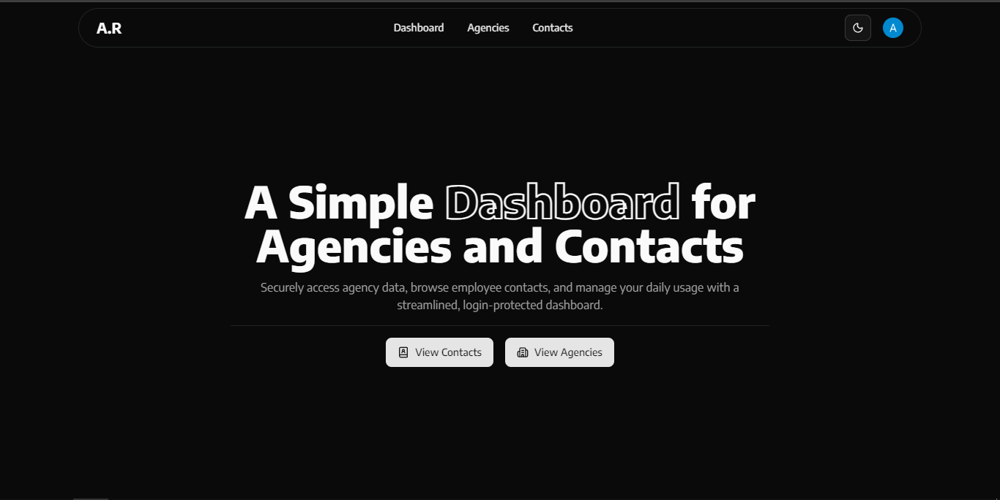
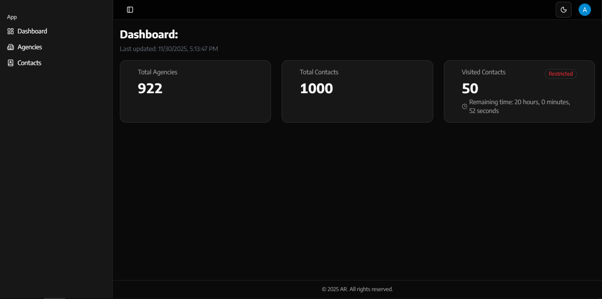
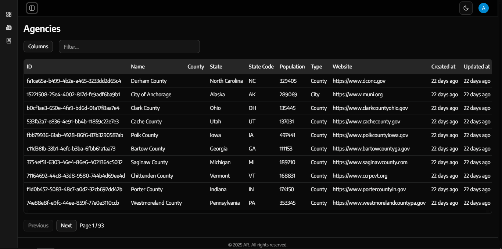
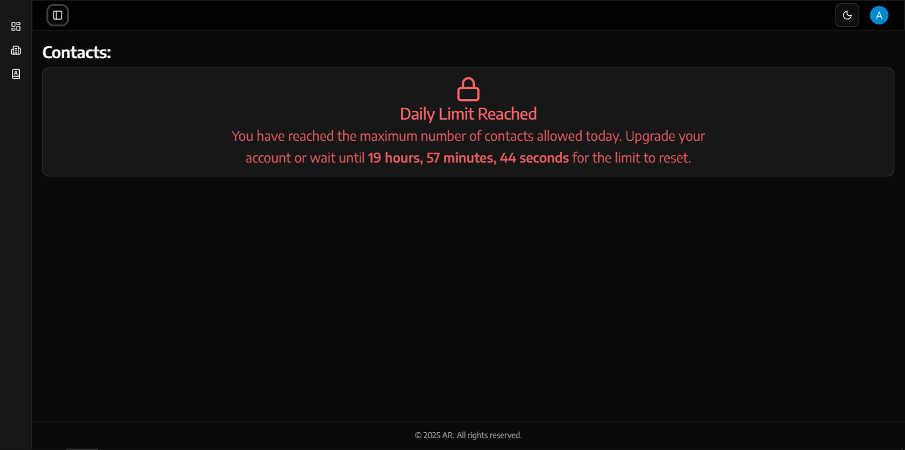
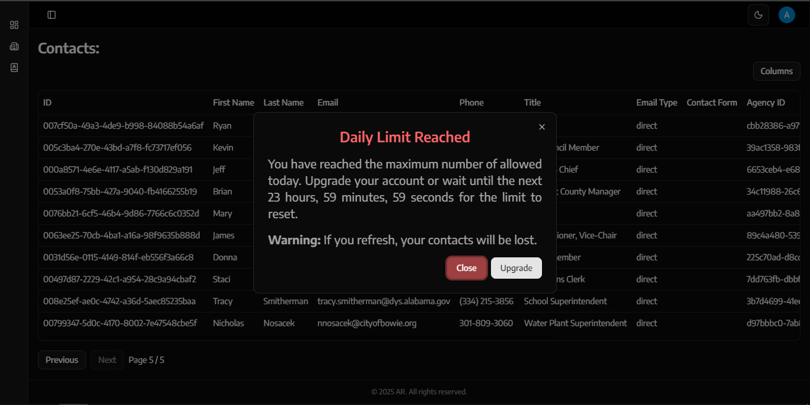

# Dashboard Application with Daily Contact Limit

A web-based dashboard application that allows authenticated users to view agencies and contacts, with a daily limit of 50 contacts per user. The project includes server-side contact limiting, pagination, filtering, and usage statistics.

---

## Features

- **User Authentication**: Only authenticated users can access the dashboard.
- **Agency Management**: View all agencies in a data table with filtering and column sorting.
- **Contact Management**:

  - Daily limit of 50 contacts per user.
  - Paginated display with 10 contacts per request.
  - Tracks viewed contacts and remaining daily quota.

- **Statistics Dashboard**: Shows total agencies, total contacts, and remaining contacts with reset timer.
- **Server-Side Limit Enforcement**: Uses cookies to track the number of contacts viewed.
- **Modular Architecture**: Clear separation of User, Server, and Service layers.

---

## Technologies

- **Frontend**: React, Next.js, TanStack Data Tables
- **Authentication**: Clerk authentication

---

## Usage

1. Clone the repository:

```bash
git clone https://github.com/rabdlbari/home-assignment-pfe.git
cd dashboard-app
```

2. Install dependencies:

```bash
npm install
# or
bun install
```

3. Run the development server:

```bash
npm run dev
```

4. Access the dashboard:

```
http://localhost:3000
```

---

## Images

### Landing Page



### Dashboard Page



### Agencies Page



### Contacts Page (Daily Limit)



### Contacts Page (Dialog Prompt)


